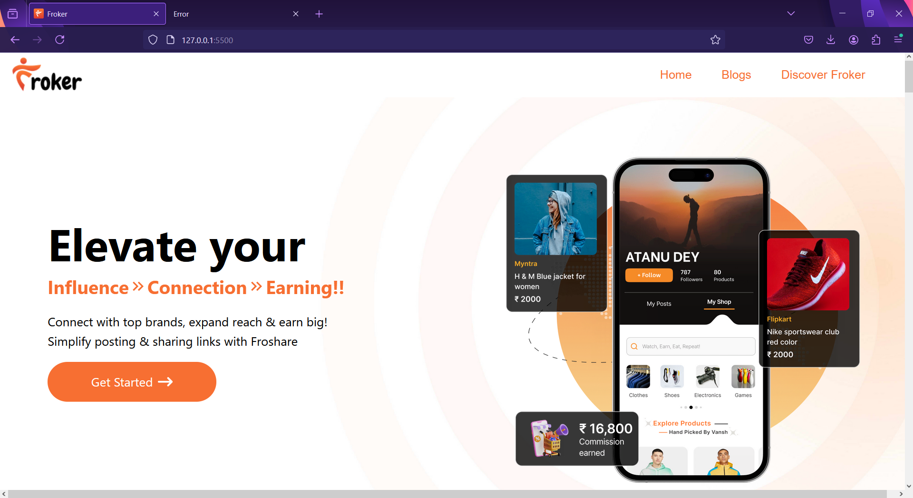
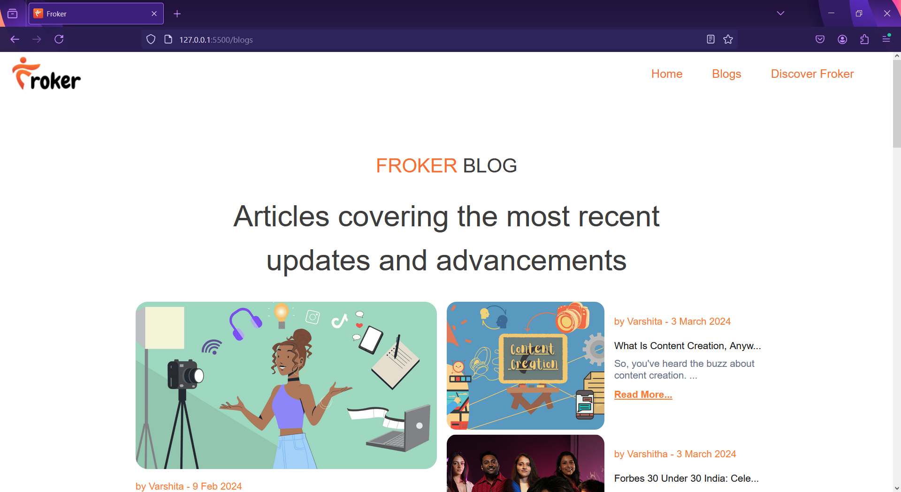

# Froker Blog Clone

This project is a full-stack web application that replicates the blog section of the website [Froker](https://www.froker.in/blogs) using the MERN stack (MongoDB, Express.js, React, Node.js).

## Table of Contents

- [Demo](#demo)
- [Features](#features)
- [Technologies Used](#technologies-used)
- [Installation](#installation)
- [Usage](#usage)
- [API Endpoints](#api-endpoints)
- [Screenshots](#screenshots)
- [Contributing](#contributing)
- [License](#license)

## Demo

Add a link to your deployed application here.

## Features

- Create, Read, Update, and Delete (CRUD) operations for blog posts
- Responsive design
- Form validation
- Integrated frontend and backend

## Technologies Used

- **Frontend**:
  - React
  - Axios
  - React Router DOM
  - CSS (or any other styling library)

- **Backend**:
  - Node.js
  - Express.js
  - MongoDB
  - Mongoose
  - CORS
  - dotenv

## Installation

1. Clone the repository:
   ```bash
   git clone https://github.com/your-username/froker-blog-clone.git
   cd froker-blog-clone
   ```

2. Set up the backend:
   ```bash
   cd backend
   npm install
   ```

3. Set up environment variables in the `.env` file:
   ```env
   MONGO_URI=your_mongodb_connection_string
   PORT=5000
   ```

4. Start the backend server:
   ```bash
   npm start
   ```

5. Set up the frontend:
   ```bash
   cd ../frontend
   npm install
   ```

6. Start the React app:
   ```bash
   npm start
   ```

## Usage

Once the installation steps are completed, the application should be running locally.

- Backend server will be running on [http://localhost:5000](http://localhost:5000)
- Frontend React app will be running on [http://localhost:3000](http://localhost:3000)

## API Endpoints

### Blog Posts

- **GET** `/blogs` - Get all blog posts
- **POST** `/blogs` - Create a new blog post
- **GET** `/blogs/:id` - Get a single blog post by ID
- **PUT** `/blogs/:id` - Update a blog post by ID
- **DELETE** `/blogs/:id` - Delete a blog post by ID

## Screenshots

### Home Page


### Blog Post


### Create Blog Form


### Edit Blog Form


## Contributing

1. Fork the repository
2. Create your feature branch (`git checkout -b feature/AmazingFeature`)
3. Commit your changes (`git commit -m 'Add some AmazingFeature'`)
4. Push to the branch (`git push origin feature/AmazingFeature`)
5. Open a pull request